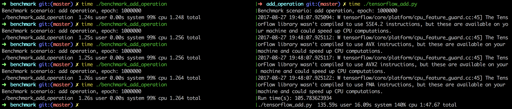
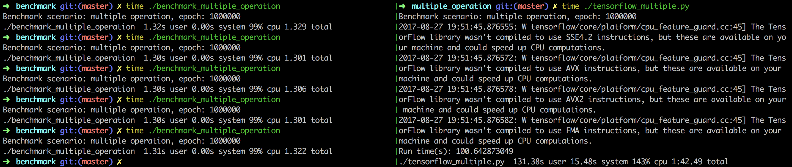
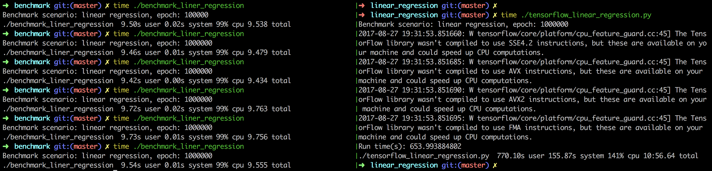

# HPLearn

## Introduction

HPLearn is the high performance machine learning system in pure C++.

- [x] Basic mathematics operations
- [x] Automatic partial derivative with chain rule 
- [x] Imperative and declarative computations
- [x] Override +-*/ operations for graph building
- [x] CMake integration for Linux/Mac/Windows
- [x] Bazel integration for build and run
- [x] Op/Graph/Session TensorFlow-like APIs
- [ ] GPU integration with Nividia CUDA library

## Installation

Build from scratch with `cmake`. 

```
cmake .

make
```

Or compile code with `bazel`.

```
bazel build hplearn:main
```

Or run directly with `docker`.

```
docker run -it tobegit3hub/hplearn bash
```

## Usage

### Import hplearn libraries

```
#include "op.h"
#include "graph.h"
#include "session.h"
#include "optimizer.h"

using namespace hplearn;
```

### Basic operations

```
VariableOp* firstOp = new VariableOp(20.2);
VariableOp* secondOp = new VariableOp(10.1);
AddOp* addOp = new AddOp(firstOp, secondOp);

cout << "Basic operation result: " << addOp->forward() << endl;
```

### Overrided operations

```
Graph* graph = new Graph();
VariableOp* variableOp1 = new VariableOp(20.2);
VariableOp* variableOp2 = new VariableOp(10.1);
AddOp* addOp = (AddOp*) (*variableOp1 + *variableOp2);
MinusOp* minusOp = (MinusOp*) (*variableOp1 - *variableOp2);
MultipleOp* multipleOp = (MultipleOp*) (*variableOp1 * *variableOp2);
DivideOp* divideOp = (DivideOp*) (*variableOp1 / *variableOp2);

Session* session = new Session(graph);
cout << "Overrided + operator result: " << to_string(session->run(addOp->getName())) << endl;
cout << "Overrided - operator result: " << to_string(session->run(minusOp->getName())) << endl;
cout << "Overrided * operator result: " << to_string(session->run(multipleOp->getName())) << endl;
cout << "Overrided / operator result: " << to_string(session->run(divideOp->getName())) << endl;
```

### Use placeholder

```
Graph* graph = new Graph();
PlaceholderOp* placeholderOp1 = new PlaceholderOp();
PlaceholderOp* placeholderOp2 = new PlaceholderOp();
AddOp* addOp = new AddOp(placeholderOp1, placeholderOp2);

Session* session = new Session(graph);
map<string, double> feedDict;
feedDict[placeholderOp1->getName()] = 20.2;
feedDict[placeholderOp2->getName()] = 10.1;
double result = session->run(addOp->getName(), feedDict);
cout << "Use placeholder result: " << to_string(result) << endl;
```

### Linear model

```
// Define graph 
Graph* graph = new Graph();
VariableOp* weights = new VariableOp(0.0);
VariableOp* bias = new VariableOp(0.0);
PlaceholderOp* x = new PlaceholderOp();
PlaceholderOp* y = new PlaceholderOp();

Op* multipleOp = *weights * *x;
Op* predictOp = *multipleOp + *bias;
Op* minusOp = *y - *predictOp;
SquareOp* lossOp = new SquareOp(minusOp);
GradientDescentOptimizer* optimizer = new GradientDescentOptimizer(graph, learningRate);
OptimizerMinimizeOp* trainOp = (OptimizerMinimizeOp*) optimizer->minimize(lossOp);

// Define session
Session* sess = new Session(graph);
map<string, double> feedDict;

for (int i=0; i<epochNumber; ++i) {
    // Start training
    feedDict[x->getName()] = feature;
    feedDict[y->getName()] = label;
    sess->run(trainOp->getName(), feedDict);

    // Print statistics
    double lossValue = sess->run(lossOp->getName(), feedDict);
    double weightValue = sess->run(weights->getName());
    double biasValue = sess->run(bias->getName());
    cout << "Epoch: " << to_string(i) << ", loss: " << to_string(lossValue) << ", weight: " 
         << to_string(weightValue) << ", bias: " << to_string(biasValue) << endl;
```

## Performance

Benchmark with [TensorFlow](https://github.com/tensorflow/tensorflow) while running 100000 epochs of [add operation](./benchmark/benchmark_add_operation.cpp), [multiple operation](./benchmark/benchmark_multiple_operation.cpp) and [linear regression](benchmark/benchmark_linear_regression.cpp). 







## Contribution

The HPLearn project is mostly inspired by [TensorFlow](https://github.com/tensorflow/tensorflow) and [MiniFlow](https://github.com/tobegit3hub/miniflow).

GitHub issues and pull-requests are highly appreciated and feel free to make your contribution.
